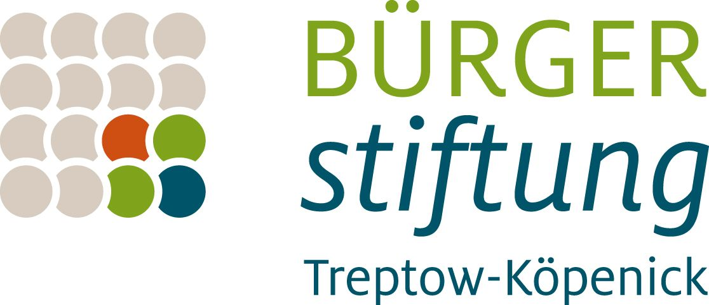
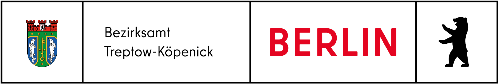

<section>
  

    

      

    

  

</section>

Ab sofort ist unsere Siedlung mit einem raren fahrbaren Untersatz
gesegnet: eine moderne elektrisch unterstützte Rikscha steht für gesellige
Aus- und Besorgungsfahrten bereit.

Das 3-Personen-Fahrrad steht für den gemächlichen Transport
mobilitätseingeschränkter Nachbar:innen, Angehöriger, Bekannter und
Freund:innen lokal zur Verfügung. Die Community pflegt, repariert und
orangisiert die Rikschanutzung ehrenamtlich, gemeinschaftlich,
selbstverwaltet.

In die "Rikschafahrkunst" eingewiesen werden neue Rad-Pilotinnen von
sachkundigen Nachbarinnen.

Vielleicht inspiriert das Konzept des Sharing-Pedaltaxis langfristig dazu,
weitere Einzel-Fahrzeuge nachbarschaftlich miteinander zu teilen - für
Freiraum, Aussicht, Entschleunigung, Ruhe und Lebensqualität auf
Mittelheide, Stellingdamm, Schmausstraße & Co.

Anwohnende, die am Fahren, am Gefahrenwerden oder am
technisch-organisatorischen Mitwirken interessiert sind, können sich unter
Angabe ihrer Kontaktdaten an [koeperikscha@tuta.io](mailto://koeperikscha@tuta.io) wenden.

Wolf & Else unterstützten die Anschaffung des modernen
Personentransportrades als Mitantragsteller bei der Bürgerstiftung
Treptow-Köpenick.
Weitere Mittelgeber der Rikscha sind der Gebietsfonds Ehemaliger
Güterbahnhof Köpenick. Außerdem wird das Projekt durch das Bezirksamt
Treptow-Köpenick von Berlin im Rahmen der Kiezkassen 2025 gefördert.

## Mit freundlicher Unterstützung von:

<section>
  

    

      

    

  

<section>
  

    

      

    

  

</section>

[www.freepik.com](https://www.freepik.com)