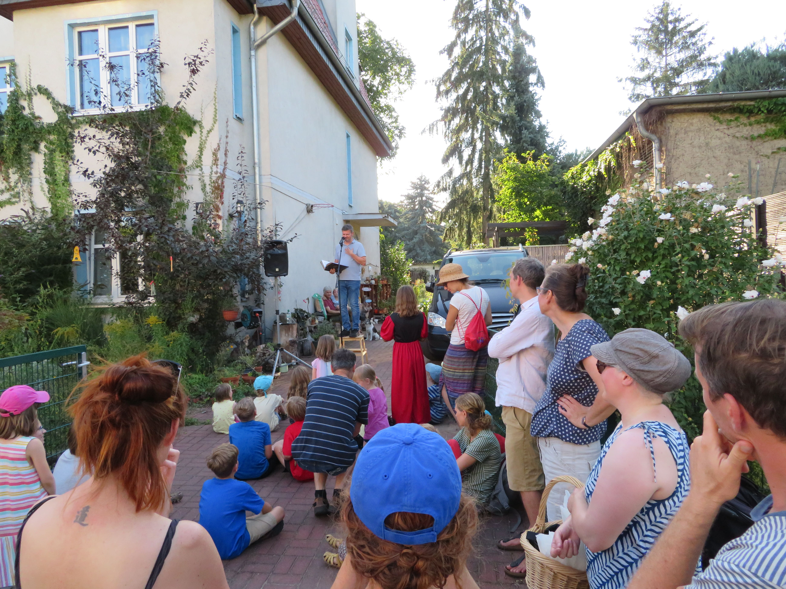
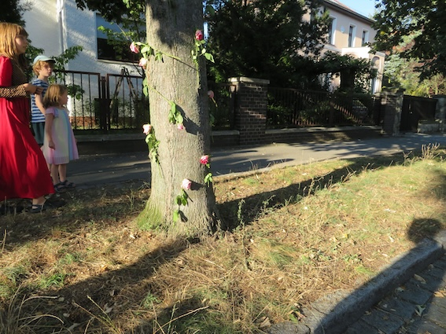
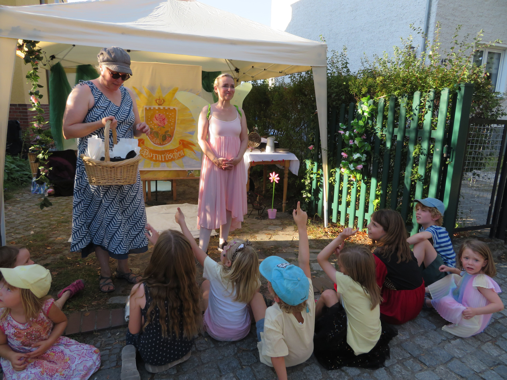
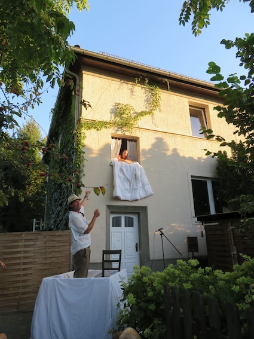

## 2. Märchentag

<section>
  

    

      

      

  
    

  

</section>

## 1. Märchentag
### Das Viertel war auf den Beinen! 
### Es wurde das Märchen, "Zu den sieben Raben" gelesen, "Dornröschen" von der Märchenelfe gespielt und Frau Holle hat ihre Betten ausgeschüttelt. Natürlich fand das alles in der Straße mit dem entsprchenden Namen statt.

<section>
  

    

      

      <section>
  

    

      

      

  
      

      

      

      

      

      

      

      

      

    

  

</section>