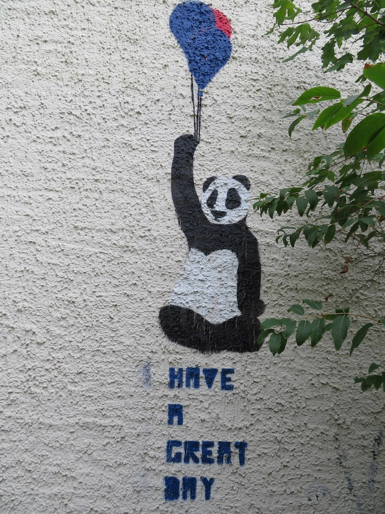

## Der Verein Wolf & Else e.V.

Unsere Vision als gemeinnütziger Verein ist es, im Köpenicker Märchenviertel bürgerschaftliches Engagement zu fördern, die Menschen im Viertel zusammenzubringen, ansässige Künstler:Innen und Kulturschaffende zu unterstützen. 

Möchtest du die Arbeit des Vereins gern unterstützen?
Wir freuen uns über eine Spende, eine Fördermitgliedschaft, eine reguläre Mitgliedschaft oder einfach über deine Schaffenskraft. 

Schreib uns gern eine Mail! Wir senden dir die Vereinsunterlagen zu.

<section>
  <h2>Image</h2>
  <h3>Fit</h3>
  

    

      

      

    

  

</section>